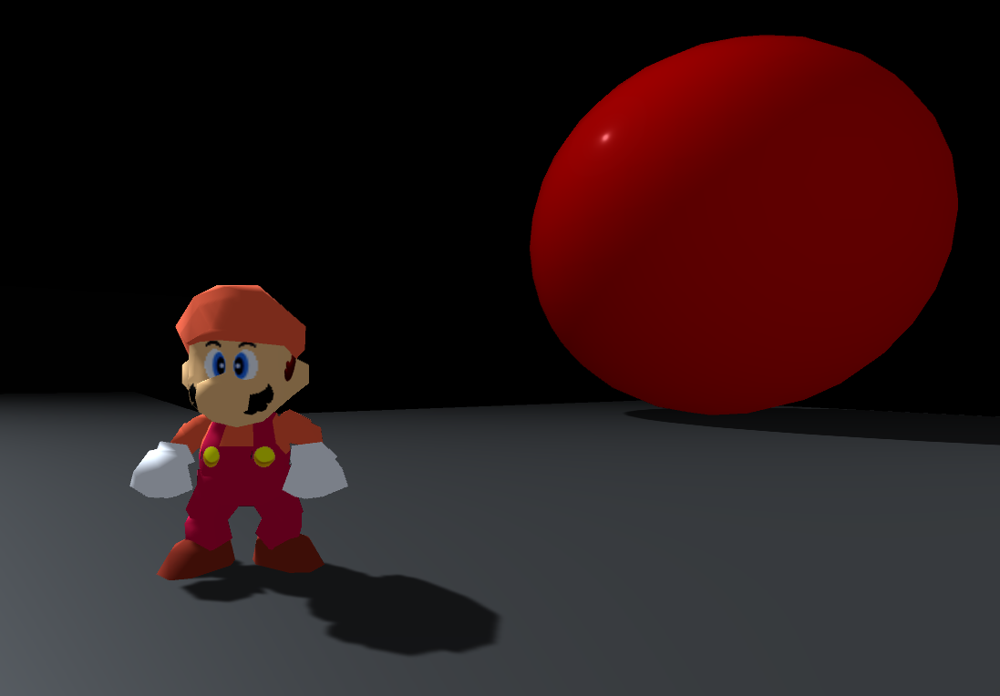

# Studio64

- **Studio64** is an all-in-one machinima editor for *Super Mario 64*, built on the Unity Engine and [n64decomp/sm64](https://github.com/n64decomp/sm64).
- In order to compile or launch the editor, a prior copy of the game is required. This is to avoid including any copyrighted material.

Features:

- Simple freeze camera (planned freecam)
- In-game color code editor
- Configurable resolution/aspect ratio, fullscreen
- Crossplatform

## Installation

### Ubuntu

Install dependencies:
```
sudo apt install -y binutils-mips-linux-gnu build-essential git libcapstone-dev pkgconf python3
```

Clone the repo from within the Linux shell: `https://github.com/Llennpie/studio64.git`

Build *libsm64*:
```
./build-libsm64
```

In order to run the editor, a prior copy of the game is required. Place a vanilla *Super Mario 64* US ROM into the repo's directory and rename it to `baserom.us.z64`. This will also be needed in the game's directory once you build the Unity project.

